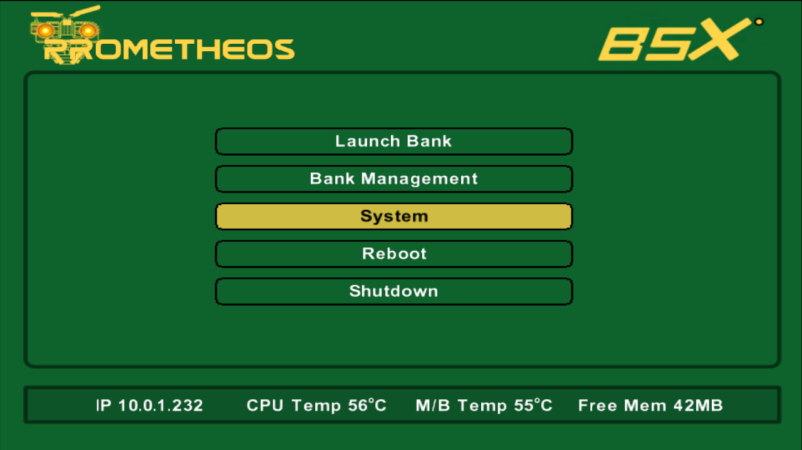
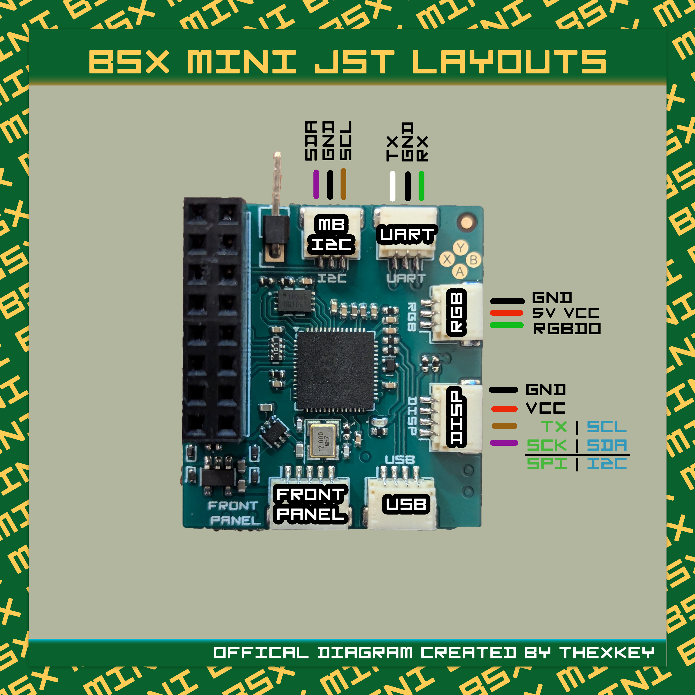

# BSX Mini ModXo Modchip

-----------------------------------------------------

This is the BSX Mini ModXo modchip. This is currently the best hardware representation of the ModXo platform that is possible with the 2040 MCU. 

This is a Pico modchip. You can run anything that will run on a pico, including the pico blink.uf2. It is my hope that more software will be developed that can make use of this platform and that what currently exists will continue to evolve. I designed them to run ModXo and PrometheOS, but the possibilities are endless. Right now, Xbox-Scene is working on hardware that will surpass this, in most people's views, at least in function. But I think that it is one of the nicest quality modchips ever made and probably will be for a long time. 

This is one of my babies. I worked hard to create a solid modchip that the community could rely on, and it absolutely is such.

It is important to note, however, that ModXO runs the RP2040 at 266 MHz, which is well beyond its stock clock speed. Not every RP2040 will reliably reach that frequency due to normal silicon-to-silicon variation. In my extended testing, this affected roughly 1 in 20 chips.

This is not a fault with the BSX Mini PCB itself. On affected boards, replacing the RP2040 with another chip resolved the issue. I have never shipped a non-working unit, because every Mini was tested before leaving me.

This discovery is one of the reasons I am moving the next generation of the design to the RP2350B. It may also be possible that later-production RP2040 silicon overclocks more consistently, but I have not tested enough newer chips to make that claim.

## Design Notes and Recommendations

There are a couple of points about this chip that I would like to make.

### ENIG is strongly recommended.
- This board was designed with ENIG surface finishing in mind. HASL will work electrically, but ENIG produces a substantially cleaner result and better suits the construction and appearance of the board. If you are having these manufactured, I strongly recommend spending the extra money on it.

### Use epoxy-filled vias.
- The design makes use of via-in-pad, so epoxy via filling is highly recommended. Without it, solder can wick into the vias during assembly, potentially starving pads of solder and contributing to poor joints or tombstoning on small passive components.

### The D0 Dupont pin specified in the BOM is an SMD part.
- It is intentionally not through-hole. I use the SMD version because it leaves a clean, domed solder joint rather than having a pin protruding through the PCB. A through-hole equivalent can be used if preferred, but it is not necessary.

### JST-SH cable specifications.
When ordering the 1.0 mm JST-SH cables, specify them as 3-pin and 4-pin, 30 cm, straight-through, black. This avoids receiving cables with reversed pin ordering or an unsuitable configuration. Below is a seller who makes them.

[https://www.aliexpress.com/store/1103211569?spm=a2g0o.order_list.order_list_main.2.304318027VQ4Ol ](https://www.aliexpress.com/item/3256809568199942.html?spm=a2g0o.order_list.order_list_main.5.304318027VQ4Ol)

### Buy Dupont cables that are as thin as possible.
The thinner the wire, the easier it is to solder to the D0 point and the less mechanical stress it places on the pad. Regardless of wire gauge, I strongly recommend securing the wire near the solder joint with tape or another form of strain relief. This helps prevent movement from eventually damaging or lifting the pad.

[https://www.aliexpress.com/item/3256806417913097.html?spm=a2g0o.order_list.order_list_main.25.304318027VQ4Ol](https://www.aliexpress.com/item/3256806417913097.html?spm=a2g0o.order_list.order_list_main.25.304318027VQ4Ol)

----------------------------------------------------------------------------

## Flashing the chip
Flashing the chip is as simple as plugging in teh USB cable, dragging and dropping the uf2 file over and unplugging. PrometheOS, if used, can flash internally. If the chip is blank, you will not need to press the bootsel button while plugging in, if the flash is already flashed, then you will need to hold the button down while plugging in the cable.

## Extra Goodies
### Cerbios Splash/JSON

If you like the colors, use this JSON!

### PrometheOS BSX Skin

## Pinout 

This may help you also come up with peripherals you wish to work with the BSX Mini and plug into it, such as the BSX-RTC.

## Acknowledgements

This project would not have been possible had it not been for the existence of ModXo and PrometheOS. It was the vague community schematic/outline from Equinox that provided the roadmap for the modchips that I worked on every single day, 16 hours a day and for 6 months straight. They are one of my greatest achievements and I am deeply grateful to the scene for giving me that gift. THEY are the real experts. Software developers are magicians to me and I will always admire them.

 - [ModXo Github Repository](https://github.com/Team-Resurgent/modxo)
 - [PrometheOS Github](https://github.com/Team-Resurgent/PrometheOS-Firmware)

Big shout out to !!!thexkey for shooting me the original schematic that had basically a pico MCU, the flash, and a USB port on it. It was these humble beginnings that the BSX Modchips were borne from. This is what the Nova looked like when I was done sitting with Key and Harcroft for a couple days and decided to create a new PCB/Project file for the rest of the project

And a big shout out to MiecraftGman, who has been with me since the beginning in the Discord and when I announced the chips on reddit.

## Support

The BSX Mods Discord: https://discord.gg/H8pHk3VbH2

The BSX Mods OG Xbox Forum: https://forums.bsxmods.net

The BSX Mods store, where you can purchase the chips, as well as its big brother, the Nova: 

https://www.bsxmods.net
Password: number5isalive

